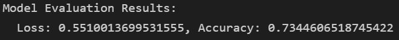

# Charity Analysis Using Neural Networks
## Overview of the Analysis
The purpose of this analysis is to help the fictional Alphabet Soup foundation predict if a charitable organization will be successful if it is funded by the Alphabet Soup foundation.

## Results
- Data Preprocessing
  - What variable(s) are considered the target(s) for your model?
    - IS_SUCCESSFUL
  - What variable(s) are considered to be the features for your model?
    - APPLICATION_TYPE, AFFILIATION, CLASSIFICATION, USE_CASE, ORGANIZATION, STATUS, INCOME_AMT, SPECIAL_CONSIDERATIONS, and ASK_AMT
  - What variable(s) are neither targets nor features, and should be removed from the input data?
    - EIN and NAME
- Compiling, Training, and Evaluating the Model
  - How many neurons, layers, and activation functions did you select for your neural network model, and why?
    - Activation functions:
      - Because this is a binary classification analysis, I selected the sigmoid function for the output node
      - For the inner layers I selected ReLU because all of the input values were greater than zero and it performed better than tanh
    - Through trial and error I found that a three layer model with a large number of neurons in the first two layers worked best for the Sequential model with this data
  - Were you able to achieve the target model performance?
    - No, the highest accuracy achieved was just over 73%
  - What steps did you take to try and increase model performance?
    - Several combinations of node count
    - Added a third hidden layer to the model
    - Dropped two additional features
    - Used the KerasTuner class to see if a more optimal design could be found
## Summary

The final result consistently achieved for this challenge was just over 73%.  

A random forest may also provide a good solution given the type of data.  I would recommend an analysis using a random forest model and compare its performance to the deep learning models created here. 
